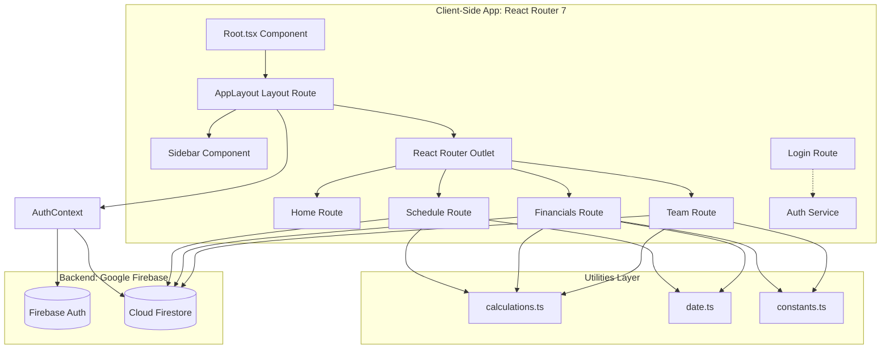
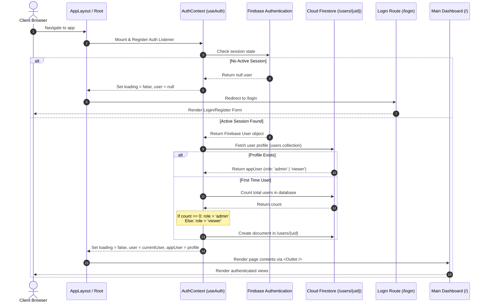
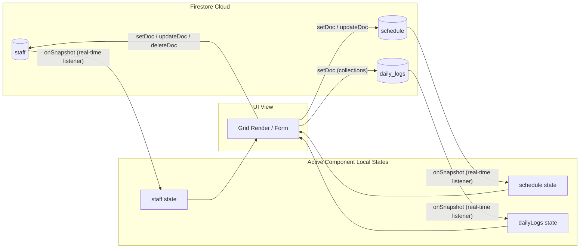
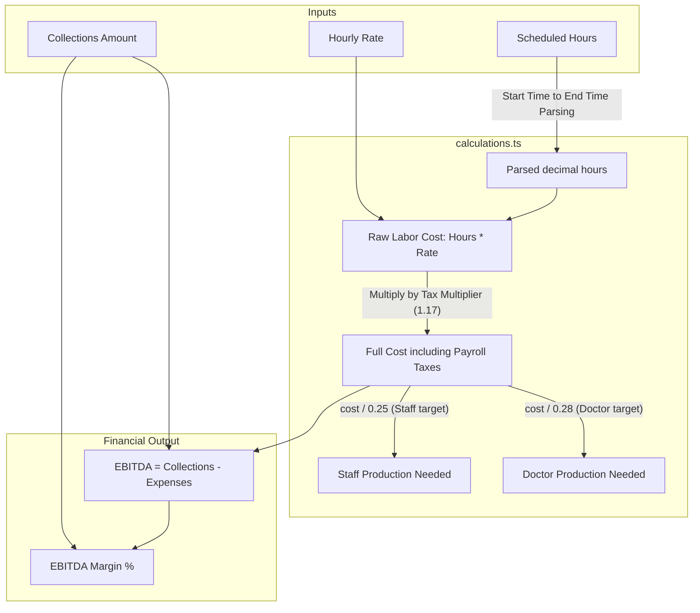

# Architectural Diagram & Design System

This document provides a comprehensive overview of the **Family Dental Station (FDS) Payroll Manager** application architecture. It serves as an architectural walkthrough for development onboarding, technical interviews, and review of system flows.

---

## 1. High-Level System Architecture

The FDS Payroll Manager is a full-stack, client-heavy web application built on a modern serverless model. 

### Key Architectural Layers:
1. **Routing Layer (React Router v7)**: Uses layout-nested routing. The layout functions as an authentication and authorization guard, injecting global authorization state via React Context.
2. **Context Layer (State)**: A centralized `AuthContext` retrieves the logged-in user from Firebase Auth, checks or instantiates their metadata role in Firestore, and exposes global auth flags (`user`, `appUser`, `loading`, `isAdmin`).
3. **Database Layer (Cloud Firestore)**: Relies on real-time collection sync (`onSnapshot`) for real-time reactivity without state management engines like Redux.
4. **Business & Utils Layer**: Self-contained mathematical calculations (payroll tax multipliers, EBITDA, production targets) and smart formatting handlers.

---

## 2. Authentication & Authorization Guard Flow

Access control is strictly enforced on the client side via the layout structure, while Firestore security rules enforce it on the server side.

### Authorization Levels
- **Admin**: Full access. Can add/edit/delete staff profiles, view hourly rates, modify app user roles (privilege management), view EBITDA and financial collections, and view daily/weekly/monthly breakdowns.
- **Viewer**: Read-only directory access. Can access the Dashboard and Weekly Schedule (read/write shifts), but financials are completely locked down. The sidebar dynamically filters administrative routes.

---

## 3. Real-Time Data Flow & State Lifecycle

Rather than relying on heavy API layers or polling, the app leverages Firestore's native WebSockets integration.

1. **Subscriptions**: On component mount, `onSnapshot` listeners are established.
2. **Reactivity**: Any database update (from any connected terminal/admin) fires a WebSocket push, triggering state setters (`setStaff`, `setSchedule`, `setDailyLogs`).
3. **Clean-Up**: Unsubscribe hooks are returned from `useEffect` to prevent memory leaks.

---

## 4. Payroll Expense & EBITDA Mathematical Model

Financial calculations are isolated in `calculations.ts` to ensure consistency across views.

### Key Business Formulas:
- **Total Loaded Cost**:
  $$\text{Loaded Cost} = \text{Hours} \times \text{Hourly Rate} \times 1.17$$
  *Note: 1.17 represents a 17% employer payroll tax & benefit loading factor.*
- **Production Needed**:
  - Staff Target: Staff costs should constitute $\le 25\%$ of production.
    $$\text{Production Target} = \frac{\text{Staff Loaded Cost}}{0.25}$$
  - Doctor Target: Doctor costs should constitute $\le 28\%$ of production.
    $$\text{Production Target} = \frac{\text{Doctor Loaded Cost}}{0.28}$$
- **EBITDA & EBITDA Margin**:
  $$\text{EBITDA} = \text{Collections} - (\text{Staff Loaded Costs} + \text{Doctor Loaded Costs})$$
  $$\text{EBITDA Margin} = \left(\frac{\text{EBITDA}}{\text{Collections}}\right) \times 100$$
